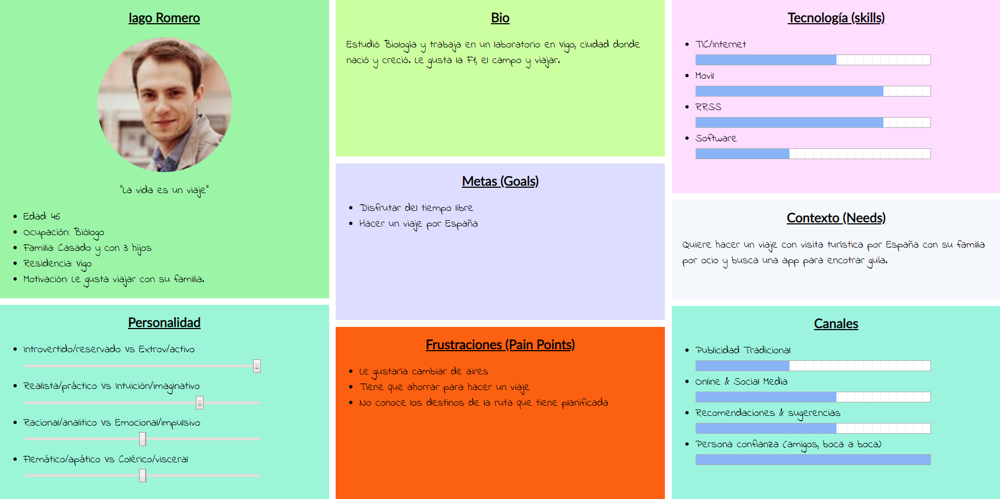

# DIU20
Prácticas Diseño Interfaces de Usuario 2019-20 (Economía Colaborativa) 

Grupo: DIU1_NJA.  Curso: 2019/20 

Proyecto: 

Descripción: 

Logotipo: 

Miembros
 * :bust_in_silhouette:   Noelia Escalera Mejías     :octocat:     
 * :bust_in_silhouette:  José Antonio Domínguez Gómez     :octocat:

----- 

## Paso 1. UX Desk Research & Analisis 

 1.a Competitive Analysis
-----
Las aplicaciones que se nos daban a elegir tenían que ver con compartir viajes. Hemos elegido Showaround porque se sale un poco de la tónica, ya que es una aplicación que propone guías turísticos para enseñar un determinado lugar, por lo que seguramente habría más aspectos a mejorar.

 1.b Persona
-----

>>> Nos metimos en https://randomuser.me/ y, a partir de los datos que nos proporcionaban, nos inventamos un perfil cada uno para un personaje. Hemos intentado buscar personas fuera de nuestros perfiles, con diferente edad, aspiraciones, etc.
>>>
>>> 
>>>
>>> 

 1.c User Journey Map
----

>>> Basados en las necesidades de los personajes, nos inventamos un viaje para cada uno. Podrían ser viajes que perfectamente podrían hacer personas con otras necesidades.
>>>
>>> 
>>>
>>> 
>>>

 1.d Usability Review
----
Visualmente, la interfaz de la aplicación no es mala. El problema viene a la hora de la funcionalidad, que es muy escasa si no se está registrado, poniendo muchas trabas. Además su lógica de negocio también deja que desear.

