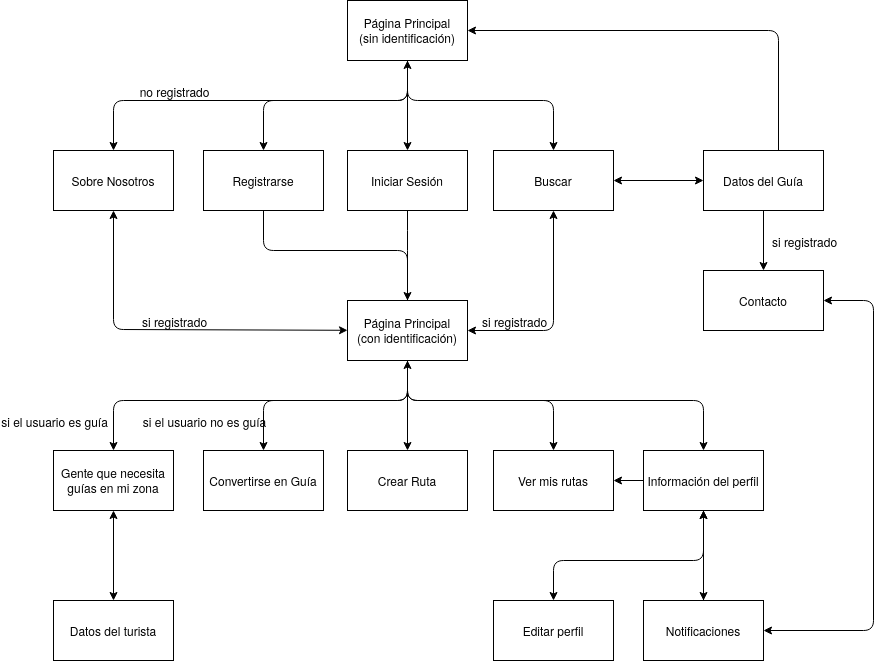
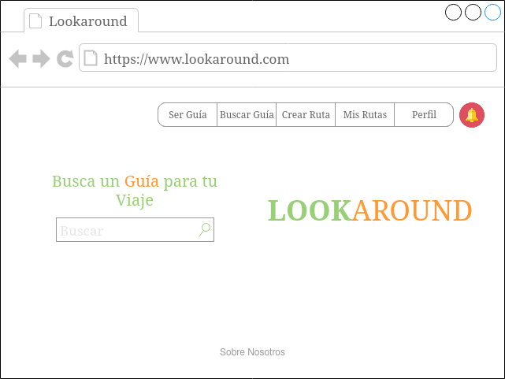
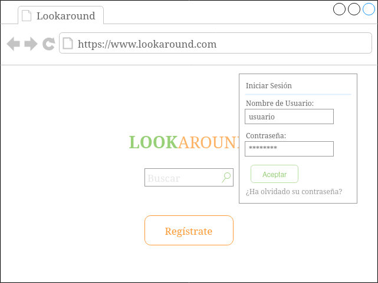
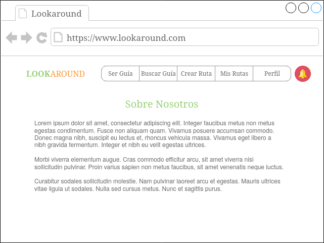
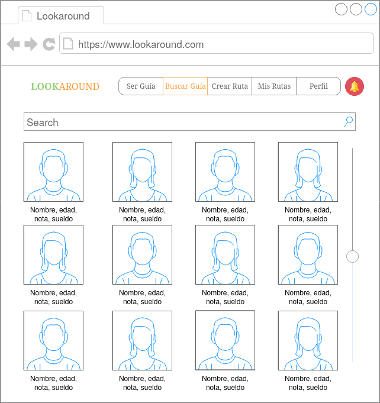
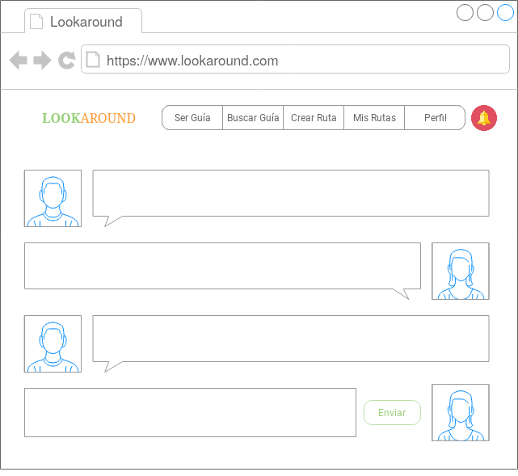
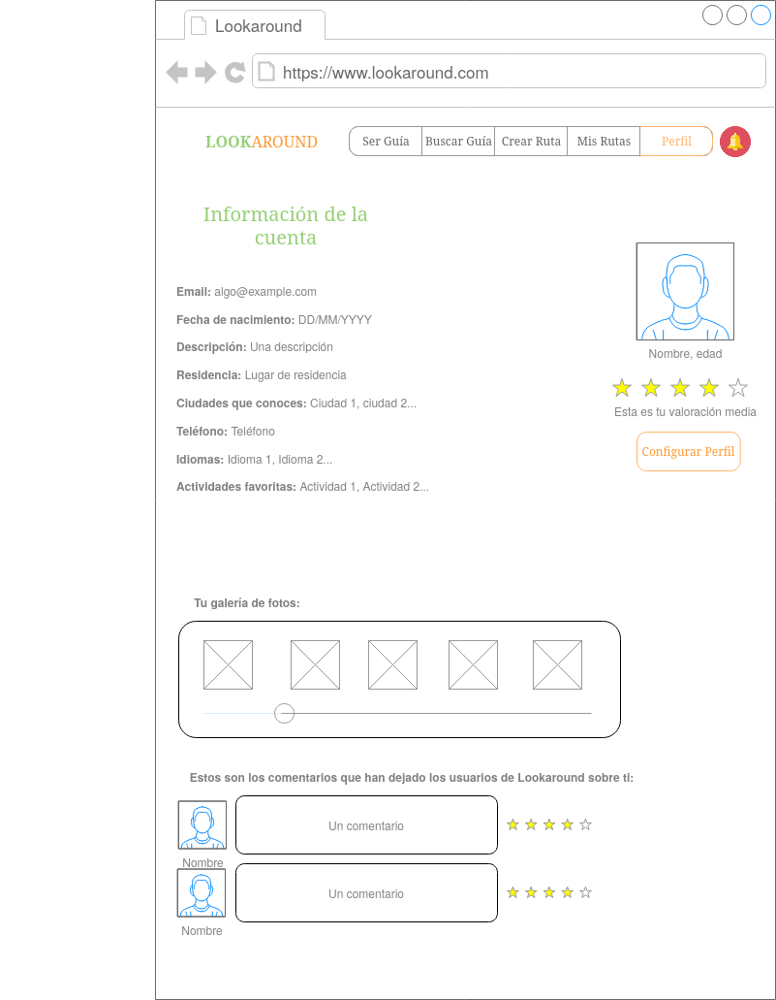
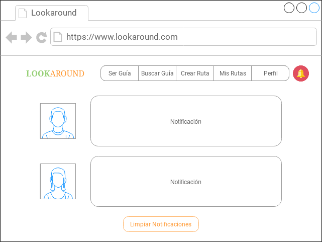

# DIU20
Prácticas Diseño Interfaces de Usuario 2019-20 (Economía Colaborativa) 

Grupo: DIU1_NJA.  Curso: 2019/20 

Proyecto: 

Descripción: 

Logotipo: 

Miembros
 * :bust_in_silhouette:   Noelia Escalera Mejías     :octocat:     
 * :bust_in_silhouette:  José Antonio Domínguez Gómez     :octocat:

----- 

## Paso 2. UX Design  

 2.a Feedback Capture Grid
----
Realmente la interfaz no era el mayor punto débil de Showaround, sino su lógica de negocio. Es en ello en lo que más nos hemos centrado en la malla receptora:

  
  

 2.b Tasks & Sitemap 
-----
**User/task Matrix**

Nuestra nueva propuesta recoge la esencia de la aplicación original: es una aplicación para buscar guías turísticos, pero irá más allá, guías y turistas podrán comunicarse sin intermediarios, los guías estarán verificados para una mayor fiabilidad, solamente habrá que pagar a los propios guías y además incluirá algunas nuevas funcionalidades.

He aquí las tareas y los grupos de usuario que hemos escogido:
  
Hemos considerado que los grupos más críticos son los jóvenes y las familias, ya que creemos que son los que más van a usar la aplicación, las familias debido a que les puede ayudar a organizar un viaje mejor en el caso de que tengan niños y los jóvenes por el tema de convertirse en guía. Las tareas más críticas serían Buscar Guía, Crear ruta y Ofrecerse como guía, ya que son las principales y por tanto las que más se usuarán.

**Sitemap**

Nota: Desde todas las hojas se puede ir a cualquier opción del menú (ver los bocetos Lo-Fi más tarde), no se han incluido todas las flechas por claridad.

 2.c Labelling 
----

 2.d Wireframes
-----

He aquí los bocetos Lo-Fi de las distintas pantallas. Se ha decidido hacerlos para ordenador (navegador web en concreto), ya que consideramos que es donde la aplicación puede funcionar mejor, pues se trata de una aplicación que se usa una vez tienes el viaje planificado y en la que vas a invertir tiempo. Es importante hacer una aclaración: Si el usuario es un guía, la opción Ser Guía del menú se cambiará por Buscar Turistas.

**Página principal (sin identificación)**

**Página principal (con identificación)**

**Inicio sesión**
 

**Registrarse**

**Sobre nosotros**

**Buscar guía**

**Datos del guía**

**Contacto**

**Crear ruta**

**Ver mis rutas**

**Convertirse en guía**

**Turistas en mi zona**

**Datos del turista**

**Información del perfil**

**Editar perfil**

**Notificaciones**

