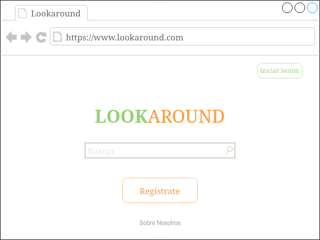
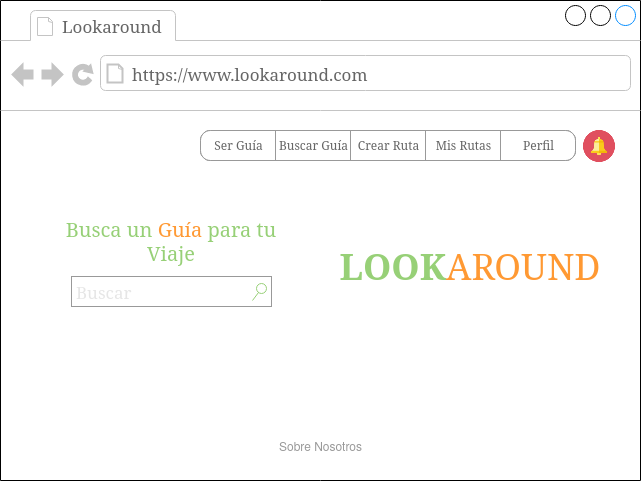
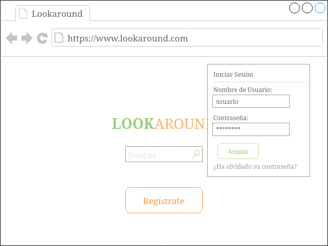
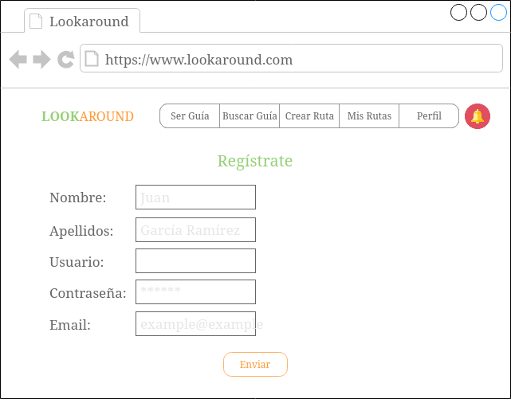
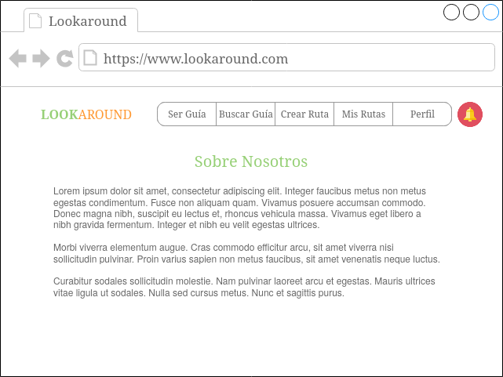
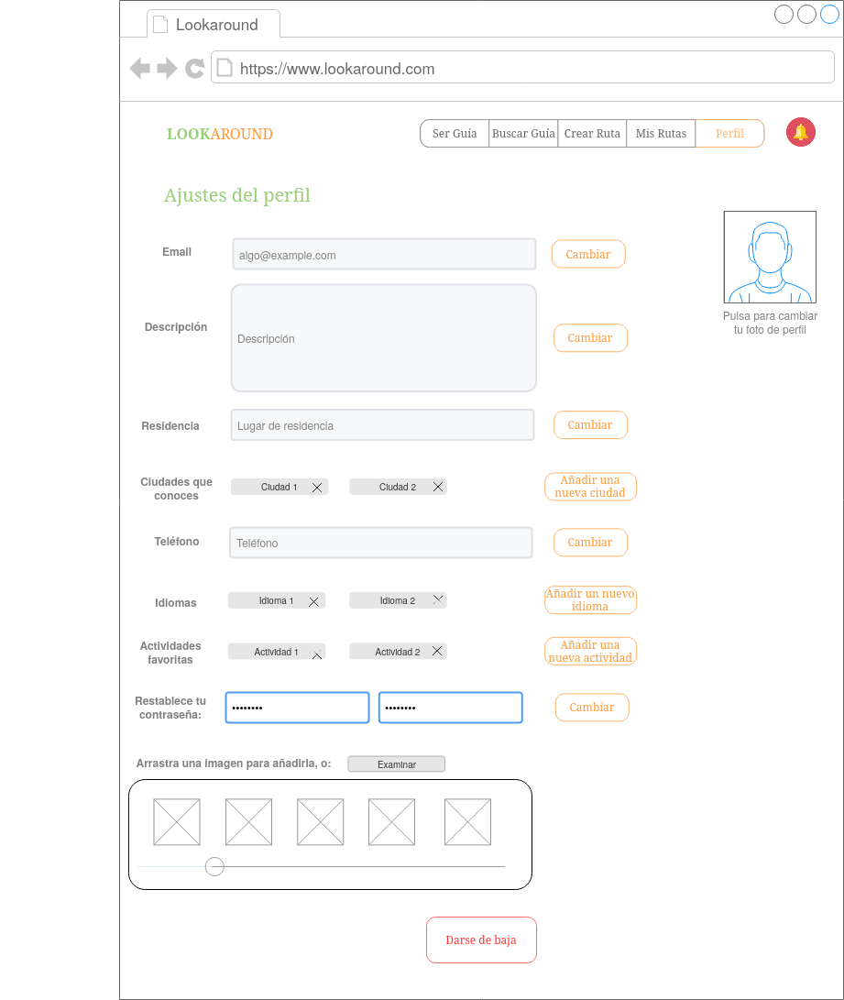
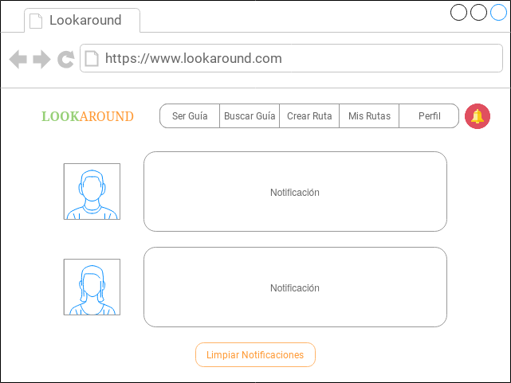

# DIU20
Prácticas Diseño Interfaces de Usuario 2019-20 (Economía Colaborativa) 

Grupo: DIU1_NJA.  Curso: 2019/20 

Proyecto: 

Descripción: 

Logotipo: 

Miembros
 * :bust_in_silhouette:   Noelia Escalera Mejías     :octocat:     
 * :bust_in_silhouette:  José Antonio Domínguez Gómez     :octocat:

----- 

En esta práctica estudiaremos un caso de plataforma de economía colaborativa y realizaremos una propuesta para su diseño Web/movil. Utilizaremos herramientas y entregables descritos en el siguiente CheckList (https://github.com/mgea/UX-DIU-Checklist) 

Qué es economia colaborativa: Martínez-Polo, J. (2019). **El fenómeno del consumo colaborativo: del intercambio de bienes y servicios a la economía de las plataformas**, *Sphera Publica, 1*(19), 24-46. http://sphera.ucam.edu/index.php/sphera-01/article/view/363/14141434

>>> Este documento es el esqueleto del report final de la práctica. Aparte de subir cada entrega a PRADO, se debe actualizar y dar formato de informe final a este documento online. 

# Proceso de Diseño 

## Paso 1. UX Desk Research & Analisis 

 1.a Competitive Analysis
-----
Las aplicaciones que se nos daban a elegir tenían que ver con compartir viajes. Hemos elegido Showaround porque se sale un poco de la tónica, ya que es una aplicación que propone guías turísticos para enseñar un determinado lugar, por lo que seguramente habría más aspectos a mejorar.

 1.b Persona
-----

>>> Nos metimos en https://randomuser.me/ y, a partir de los datos que nos proporcionaban, nos inventamos un perfil cada uno para un personaje. Hemos intentado buscar personas fuera de nuestros perfiles, con diferente edad, aspiraciones, etc.
>>>
>>> 
>>>
>>> 

 1.c User Journey Map
----

>>> Basados en las necesidades de los personajes, nos inventamos un viaje para cada uno. Podrían ser viajes que perfectamente podrían hacer personas con otras necesidades.
>>>
>>> 
>>>
>>> 
>>>

 1.d Usability Review
----
Visualmente, la interfaz de la aplicación no es mala. El problema viene a la hora de la funcionalidad, que es muy escasa si no se está registrado, poniendo muchas trabas. Además su lógica de negocio también deja que desear.

## Paso 2. UX Design  

 2.a Feedback Capture Grid
----
Realmente la interfaz no era el mayor punto débil de Showaround, sino su lógica de negocio. Es en ello en lo que más nos hemos centrado en la malla receptora:

  
  

 2.b Tasks & Sitemap 
-----
**User/task Matrix**

Nuestra nueva propuesta recoge la esencia de la aplicación original: es una aplicación para buscar guías turísticos, pero irá más allá, guías y turistas podrán comunicarse sin intermediarios, los guías estarán verificados para una mayor fiabilidad, solamente habrá que pagar a los propios guías y además incluirá algunas nuevas funcionalidades.

He aquí las tareas y los grupos de usuario que hemos escogido:
  
Hemos considerado que los grupos más críticos son los jóvenes y las familias, ya que creemos que son los que más van a usar la aplicación, las familias debido a que les puede ayudar a organizar un viaje mejor en el caso de que tengan niños y los jóvenes por el tema de convertirse en guía. Las tareas más críticas serían Buscar Guía, Crear ruta y Ofrecerse como guía, ya que son las principales y por tanto las que más se usuarán.

**Sitemap**

Nota: Desde todas las hojas se puede ir a cualquier opción del menú (ver los bocetos Lo-Fi más tarde), no se han incluido todas las flechas por claridad.

 2.c Labelling 
----

 2.d Wireframes
-----

He aquí los bocetos Lo-Fi de las distintas pantallas. Se ha decidido hacerlos para ordenador (navegador web en concreto), ya que consideramos que es donde la aplicación puede funcionar mejor, pues se trata de una aplicación que se usa una vez tienes el viaje planificado y en la que vas a invertir tiempo. Es importante hacer una aclaración: Si el usuario es un guía, la opción Ser Guía del menú se cambiará por Buscar Turistas.

**Página principal (sin identificación)**

**Página principal (con identificación)**

**Inicio sesión**
 

**Registrarse**

**Sobre nosotros**

**Buscar guía**

**Datos del guía**

**Contacto**

**Crear ruta**

**Ver mis rutas**

**Convertirse en guía**

**Turistas en mi zona**

**Datos del turista**

**Información del perfil**

**Editar perfil**

**Notificaciones**

## Paso 3. Make (Prototyping) 

 3.a Moodboard
-----

>>> Plantear Diseño visual con una guía de estilos visual (moodboard) 

  3.b Landing Page
----

>>> Plantear Landing Page 

 3.c Guidelines
----

>>> Estudio de Guidelines y Patrones IU a usar 

  3.d Mockup
----

>>> Layout: Mockup / prototipo HTML  (que permita simular tareas con estilo de IU seleccionado)

## Paso 4. UX Check (Usability Testing) 

 4.a A/B Testing
----

>>> Comprobacion de asignaciones para A/B Testing. Asignaciones https://github.com/mgea/DIU19/blob/master/ABtesting.md

>>>> Práctica A: 

 4.b User Testing
----

>>> Usuarios para evaluar prácticas 

| Usuarios | Sexo/Edad     | Ocupación   |  Exp.TIC    | Personalidad | Plataforma | TestA/B
| ------------- | -------- | ----------- | ----------- | -----------  | ---------- | ----
| User1's name  | H / 18   | Estudiante  | Media       | Introvertido | Web.       | A 
| User2's name  | H / 18   | Estudiante  | Media       | Timido       | Web        | A 
| User3's name  | M / 35   | Abogado     | Baja        | Emocional    | móvil      | B 
| User4's name  | H / 18   | Estudiante  | Media       | Racional     | Web        | B 

. 4.c Cuestionario SUS
----

>>> Usaremos el **Cuestionario SUS** para valorar la satisfacción de cada usuario con el diseño (A/B) realizado. Para ello usamos la [hoja de cálculo](https://github.com/mgea/DIU19/blob/master/Cuestionario%20SUS%20DIU.xlsx) para calcular resultados sigiendo las pautas para usar la escala SUS e interpretar los resultados
http://usabilitygeek.com/how-to-use-the-system-usability-scale-sus-to-evaluate-the-usability-of-your-website/)
Para más información, consultar aquí sobre la [metodología SUS](https://cui.unige.ch/isi/icle-wiki/_media/ipm:test-suschapt.pdf)

>>> Adjuntar captura de imagen con los resultados + Valoración personal 

 4.c Usability Report
----

>> Añadir report de usabilidad para práctica B 

## Paso 5. Evaluación de Accesibilidad  

  5.a Accesibility evaluation Report
----

>>> Indica qué pretendes evaluar (de accesibilidad) y qué resultados has obtenido + Valoración personal

>>> Evaluación de la Accesibilidad (con simuladores o verificación de WACG) 

## Conclusión / Valoración de las prácticas

>>> (90-150 caracteres) Opinión del proceso de desarrollo de diseño siguiendo metodología UX y valoración (positiva /negativa) de los resultados obtenidos  

