# DIU20
Prácticas Diseño Interfaces de Usuario 2019-20 (Economía Colaborativa) 

Grupo: DIU1_NJA.  Curso: 2019/20 

Proyecto: Lookaround

Descripción: Lookaround es una aplicación de economía colaborativa orientada a guías turísticos. En ella se podrá bien contratar un guía turístico, bien ofrecer una ruta en la que necesitas guía u ofrecerte como guía y ganar dinero.

Logotipo: 

Miembros
 * :bust_in_silhouette:   Noelia Escalera Mejías     :octocat:     
 * :bust_in_silhouette:  José Antonio Domínguez Gómez     :octocat:

----- 
Todos tenemos en mente alguna aplicación de economía colaborativa para buscar compañero de viaje pero, ¿alguna vez hemos pensado en una aplicación destinada a encontrar guías turísticos? Podría ser una gran idea, ya que hay algunos sitios donde sería prácticamente imposible encontrar un guía. Además, ¿quién mejor que alguien que vive en un lugar para enseñarte sus mayores virtudes?

# Proceso de Diseño 

## Paso 1. UX Desk Research & Analisis 
Ver más en 

 1.a Competitive Analysis
-----
Era necesario investigar si ya existía alguna aplicación de este tipo. Encontramos Showaround, que tiene bastante buenas ideas, sin embargo, falla en la ejecución de estas. No enseña mucha información de primeras, parte de la funcionalidad es difícilmente accesible o difícil de usar. Nuestra aplicación debe distanciarse de eso. Decidimos estudiar más en profundidad la aplicación Showaround.

 1.b Persona
-----

Decidimos crear dos personas que podrían estar interesadas en usar una app de este tipo, para ver cuál serán sus problemas e inquietudes a la hora de usar la app, para así poder realizar un mejor análisis de las necesidades que debería cubrir nuestra aplicación.
>>>
>>> 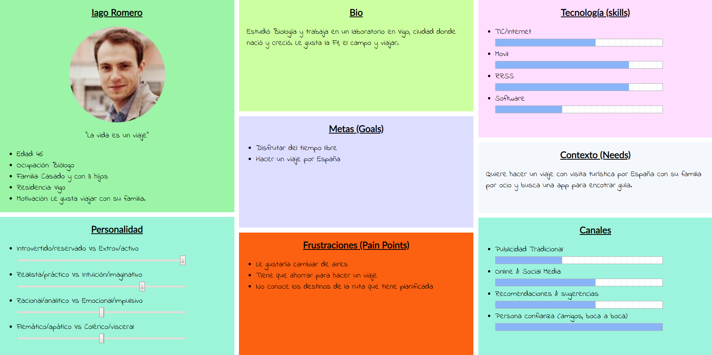
>>>
>>> 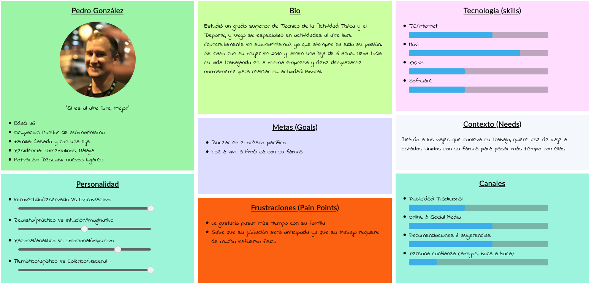

 1.c User Journey Map
----

Decidimos crear un Journey Map para cada una de estas personas y así encontrar qué problemas se podrían encontrar a la hora de usar la app. De este modo, podríamos solventar posibles errores de diseño en una etapa muy temprana del desarrollo, lo cual aumenta las posibilidades de éxito del proyecto y disminuye el riesgo y el coste del mismo.
>>>
>>> 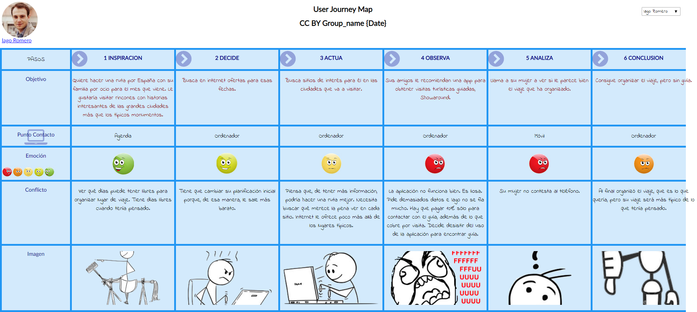
>>>
>>> 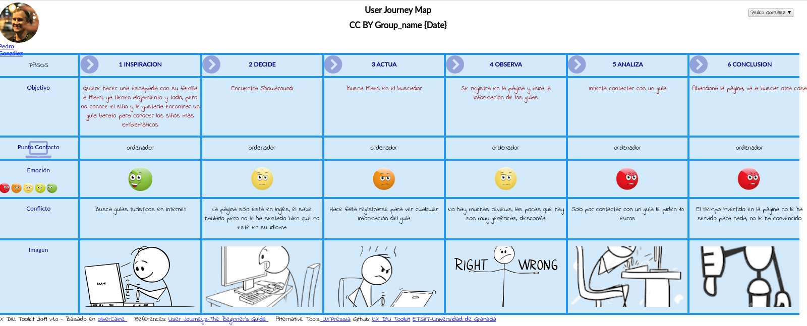
>>>

Con ello descubrimos que la aplicación ponía demasiadas trabas al usuario durante su uso. El principal inconveniente es que solicitaba un pago habiendo mostrado sólo una pequeña parte de la funcionalidad, lo cual transmite desconfianza y predispone negativamente al usuario, a la vez que hace que el usuario no pueda probar el resto de la funcionalidad de nuestra aplicación, por lo que no se le crea la necesidad de usarla y cae rápidamente en el olvido.

 1.d Usability Review
----

Decidimos hacer un análisis más exhaustivo esta app y hacer una Usability Review, para así poder detectar más virtudes y problemas de la app. Tras este análisis, llegamos a la conclusión de que, visualmente, la interfaz de la aplicación es buena. El problema viene a la hora de analizar la funcionalidad, que deja que desear. Es muy escasa si no se está registrado, poniendo muchas trabas para el disfrute de una experiencia completa de todas las características que ofrece. El balance general es negativo, principalmente por debido a errores de diseño y de lógica de negocio.

## Paso 2. UX Design  

Ver más en 

 2.a Feedback Capture Grid
----

Era hora de pensar qué podíamos mejorar de esta aplicación. Para ello, decidimos hacer la siguiente malla receptora:

  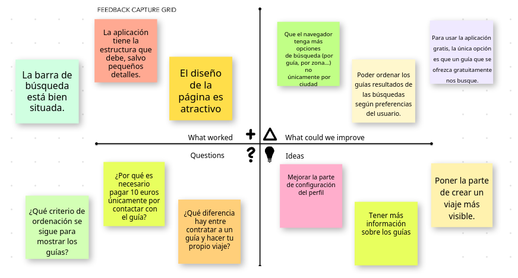
  
 Realmente la interfaz no era el mayor punto débil de Showaround, sino su lógica de negocio.

 2.b Tasks & Sitemap 
-----
**User/task Matrix**

Ya con las ideas más claras, realizamos un User/Task Matrix de lo que iba a ser nuestra aplicación. Nuestra nueva propuesta recoge la esencia de la aplicación original: es una aplicación para buscar guías turísticos, pero irá más allá: guías y turistas podrán comunicarse sin intermediarios, los guías estarán verificados para una mayor fiabilidad, solamente habrá que pagar a los propios guías y, además, incluirá algunas nuevas funcionalidades.

He aquí las tareas y los grupos de usuario que hemos escogido:

  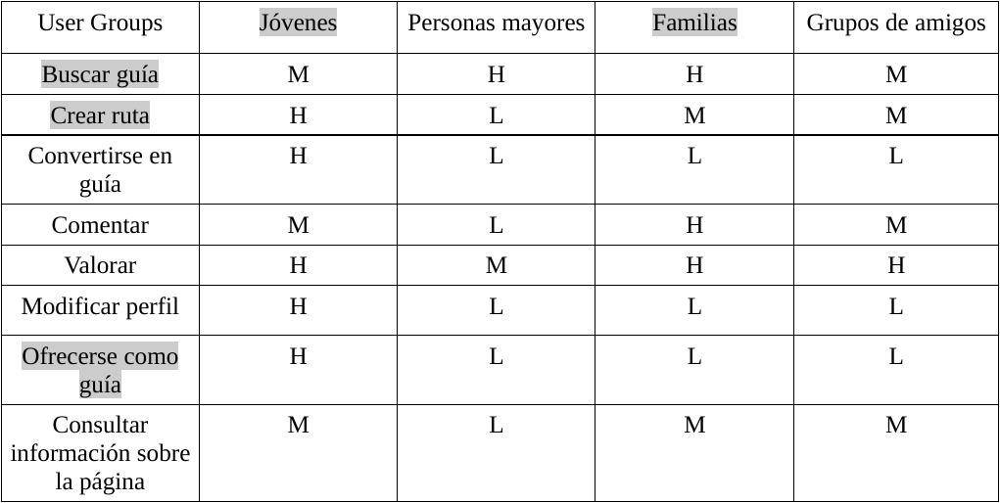

Hemos considerado que los grupos más críticos son los jóvenes y las familias, ya que creemos que son los que más van a usar la aplicación: las familias debido a que les puede ayudar a organizar un viaje más interesante en el caso de que tengan niños y los jóvenes porque son más susceptibles a convertirse en guías. Las tareas más críticas serían buscar guía, crear ruta y ofrecerse como guía, ya que son las principales y por tanto las que más se usuarán.

**Sitemap**

También fue necesario crear un Sitemap con el objetivo de tener más clara la estructura y el diseño de la aplicación. Cabe destacar que se aumenta bastante la funcionalidad disponible sin estar registrado respecto de la que ofrece Showaround:

  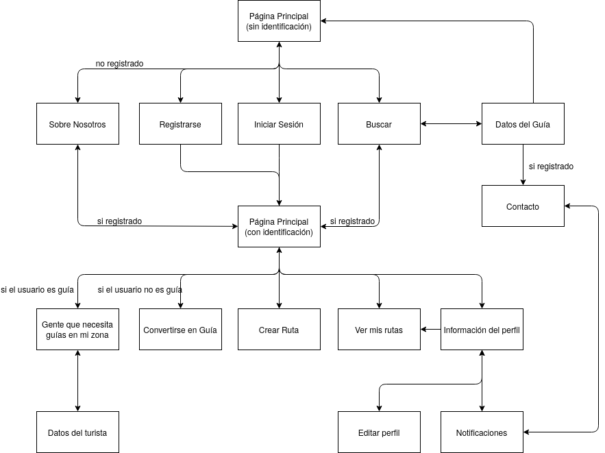

Nota: Desde todas las hojas se puede ir a cualquier opción del menú (ver los bocetos Lo-Fi más tarde), no se han incluido todas las flechas por claridad.

 2.c Labelling 
----

Y un labelling para identificar las posibles acciones y tareas:

  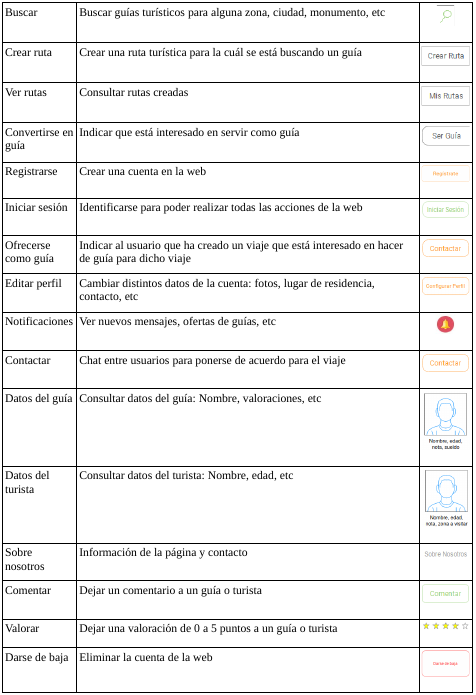

 2.d Wireframes
-----

Diseñamos entonces los bocetos Lo-Fi, los realizamos para web, ya que creemos que es más representativo que el diseño móvil al prever que el PC será el dispositivo más usado para acceder a la aplicación. He aquí algunos de los más interesantes (se pueden ver todos en el Readme de la P3):

Hemos aumentado la información disponible sobre los guías:

  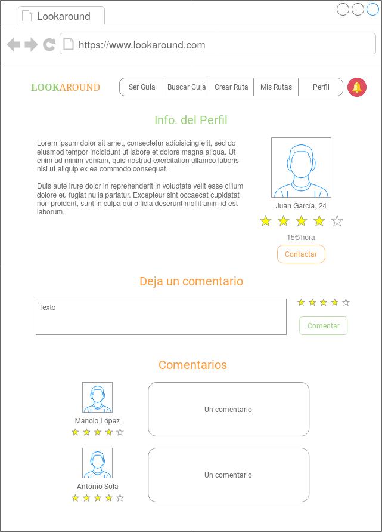

También hemos añadido un chat para que guía y turista puedan comunicarse sin intermediarios:

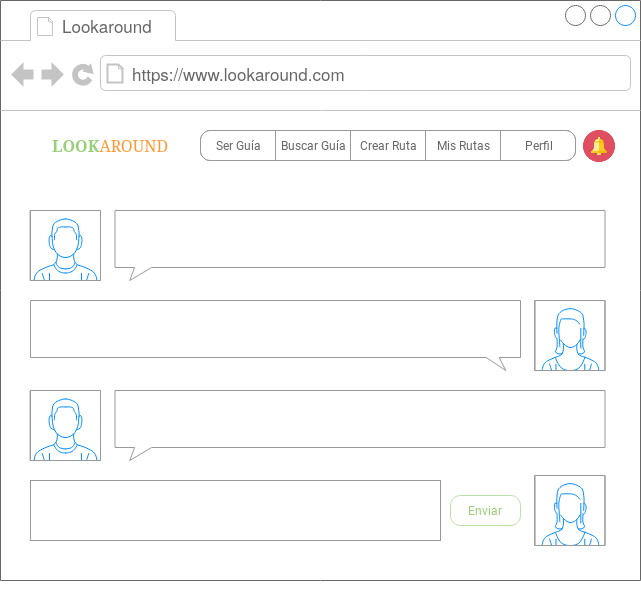

Hemos hecho más claro el proceso de crear rutas:

  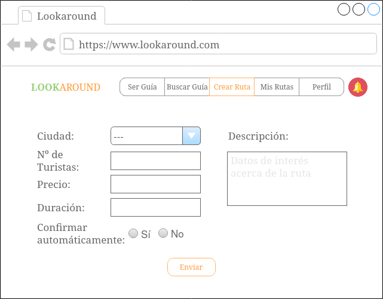

Y también el de verlas:

  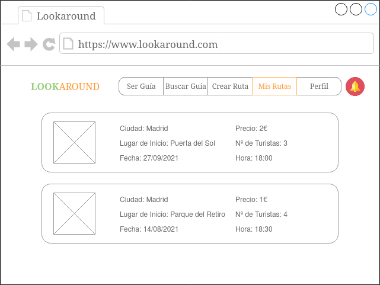

Hemos creado un espacio específico para convertirse en guía:

  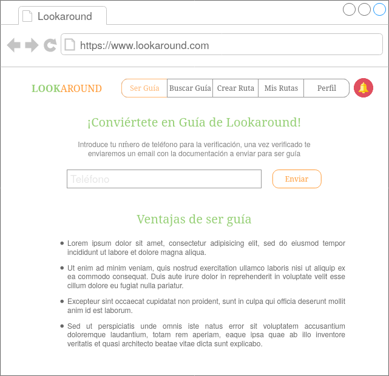

Los guías podrán consultar los turistas de su zona:

  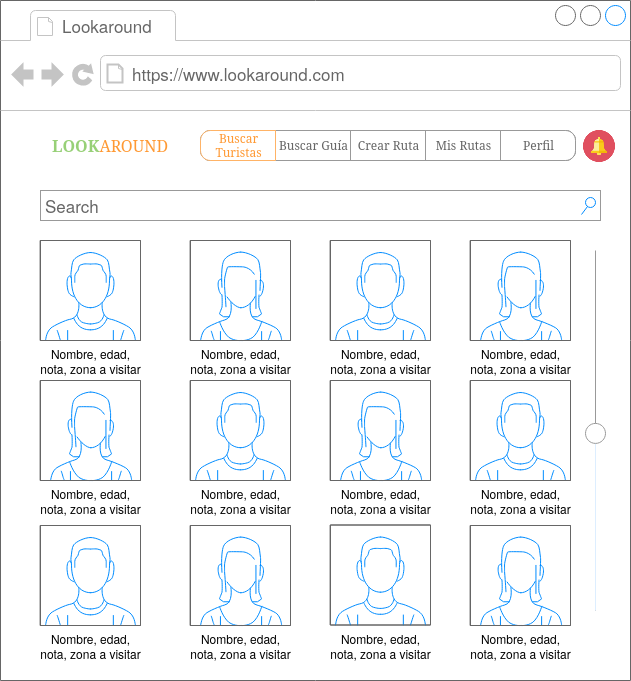

Y sus datos:

  

Y hemos aumentado la información del perfil:

  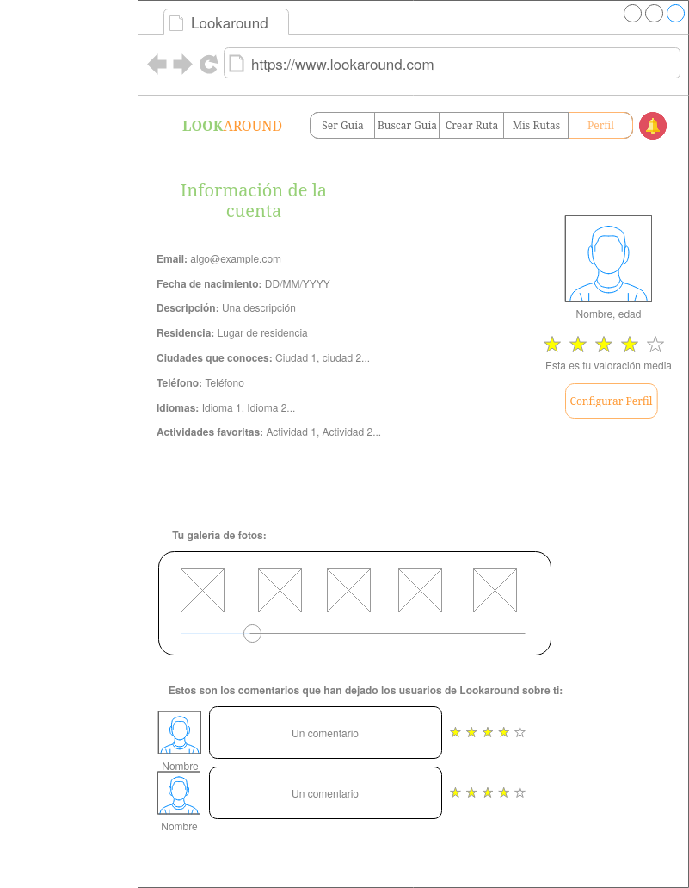

## Paso 3. Make (Prototyping) 

 3.a ¿Como se cuenta un UX-Case Study?
-----

Investigamos la historia de Moodboard para inspirarnos en ella. El proceso de creación de MuseMap nos ha parecido bastante completo. Destacamos el análisis centrado en el usuario, que les ha hecho descubrir las verdaderas necesidades que éstos presentan. Gracias al mapa de empatía, se ha podido averiguar las tendencias de las personas. A través de las entrevistas de los usuarios, se han descubierto necesidades más específicas. Elaborando el mapa de afinidad, se ha podido indagar más en los puntos descubiertos en el mapa de empatía. Y, con las personas y mapas de experiencia, se han descubierto las necesidades de distintos perfiles.

Nos gustaría también destacar el Task Analysis, ya que nos ha parecido interesante y diferente a lo empleado en la práctica, y nos ayuda a imaginar distintas situaciones, pero quizás añadiríamos un párrafo explicativo como en el Journey Map, aunque no necesariamente se eche en falta. Además, toda la información que viene tras el Journey Map nos ayuda a identificar mejor las motivaciones del usuario.

Por otro lado, cabe destacar el análisis competitivo, que les ha permitido identificar los puntos que pueden hacer que su aplicación se distinga del resto, identificando qué es lo que necesita el usuario y qué no necesita, como, por ejemplo, añadir recomendaciones personales o evitar que los usuarios sean consultados por otros usuarios.

También destacamos el gran proceso de depuración de los prototipos, haciendo varias versiones cada vez entrando más en detalle. El cambio que habríamos hecho nosotros es hacer el Sitemap antes de los primeros diseños, para así tener una visión general de la estructura de la aplicación.

  3.b Logotipo
----

Nuestra propuesta de logotipo:
 

 3.c Guidelines
----

Estas han sido las decisiones de diseño que hemos tomado:

- Para la fuente del sitio hemos optado por una fuente de tipo {\it Sans Serif}, ya que son muy adecuadas para su lectura y transmiten una sensación amigable a la vez que formal. En concreto hemos decidido usar {\it Open Sans}, debido a que nos ha parecido que no tiene una forma excesivamente arriesgada, que no llama la atención de manera excesiva, pero cumple su objetivo, es decir, hace que la página sea atractiva.

- En cuanto a los colores hemos tomado las siguientes decisiones:

  - De color de fondo hemos elegido blanco, debido a que aportará luminosidad y claridad a la página.
  
  - Como color principal del texto hemos escogido el negro, para contrastar con el blanco de fondo.
  
  - Los otros colores principales que usaremos son la triada naranja-verde-morado, ya que son una buena combinación equilibrada y adecuada para cualquier tipo de persona. Además el naranja inspira energía y diversión que es algo que quiere transmitir nuestra página. De esta triada, el color que tendrá más protagonismo será el naranja, seguido del verde, que usaremos para transmitir calma y por último el morado que usaremos para resaltar algo interesante. Cabe mencionar que usaremos tonalidades pastel de estos colores, que suelen venir bien tanto para temas oscuros como claros.
  
  - De manera adicional usaremos el rojo para indicar alerta o una acción más peligrosa por así decirlo (por ejemplo, en el botón de darse de baja).
  
- La aplicación tendrá un menú de navegación en la parte superior, al tener un control de acceso basado en roles. Las acciones del menú no serán siempre las mismas debido a dichos roles (la funcionalidad disponible y, por tanto, el contenido del menú, dependerá del usuario). De esta forma tendremos un diseño más limpio y ordenado. Además, en este menú se resaltará el lugar de la aplicación en la que el usuario se encuentra (por ejemplo, si se encuentra en "Buscar guía", esta opción en el menú aparcerá resaltada).

- No será necesario usar breadcrums, ya que a partir de los ID's de cada página y del menú mencionado anteriormente no se favorece el uso de esta herramienta.

- Donde proceda mostrar una galería, ésta se mostrará en forma de carrusel de imágenes, ya es más dinámico, que es algo acorde a la sensación que quiere transmitir la página. Si el usuario lo desea, podrá pulsar un botón para desplegar las imágenes para que se muestren de forma estática, de manera que pueda abarcarlas de un vistazo.

  3.d Vídeo
----

>>> Layout: Mockup / prototipo HTML  (que permita simular tareas con estilo de IU seleccionado)

## Paso 4. UX Check (Usability Testing) 

 4.a A/B Testing
----

>>> Comprobacion de asignaciones para A/B Testing. Asignaciones https://github.com/mgea/DIU19/blob/master/ABtesting.md

>>>> Práctica A: 

 4.b User Testing
----

>>> Usuarios para evaluar prácticas 

| Usuarios | Sexo/Edad     | Ocupación   |  Exp.TIC    | Personalidad | Plataforma | TestA/B
| ------------- | -------- | ----------- | ----------- | -----------  | ---------- | ----
| User1's name  | H / 18   | Estudiante  | Media       | Introvertido | Web.       | A 
| User2's name  | H / 18   | Estudiante  | Media       | Timido       | Web        | A 
| User3's name  | M / 35   | Abogado     | Baja        | Emocional    | móvil      | B 
| User4's name  | H / 18   | Estudiante  | Media       | Racional     | Web        | B 

. 4.c Cuestionario SUS
----

>>> Usaremos el **Cuestionario SUS** para valorar la satisfacción de cada usuario con el diseño (A/B) realizado. Para ello usamos la [hoja de cálculo](https://github.com/mgea/DIU19/blob/master/Cuestionario%20SUS%20DIU.xlsx) para calcular resultados sigiendo las pautas para usar la escala SUS e interpretar los resultados
http://usabilitygeek.com/how-to-use-the-system-usability-scale-sus-to-evaluate-the-usability-of-your-website/)
Para más información, consultar aquí sobre la [metodología SUS](https://cui.unige.ch/isi/icle-wiki/_media/ipm:test-suschapt.pdf)

>>> Adjuntar captura de imagen con los resultados + Valoración personal 

 4.c Usability Report
----

>> Añadir report de usabilidad para práctica B 

## Paso 5. Evaluación de Accesibilidad  

  5.a Accesibility evaluation Report
----

>>> Indica qué pretendes evaluar (de accesibilidad) y qué resultados has obtenido + Valoración personal

>>> Evaluación de la Accesibilidad (con simuladores o verificación de WACG) 

## Conclusión / Valoración de las prácticas

>>> (90-150 caracteres) Opinión del proceso de desarrollo de diseño siguiendo metodología UX y valoración (positiva /negativa) de los resultados obtenidos  

